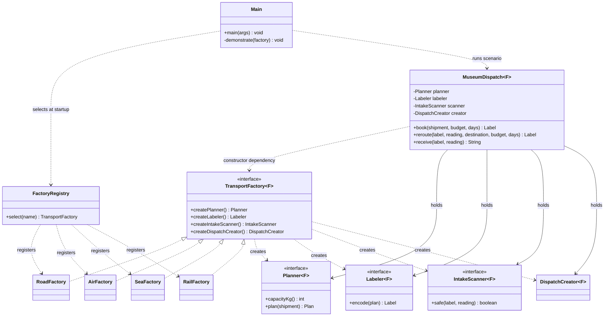
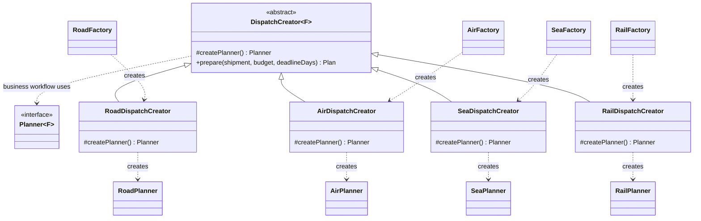
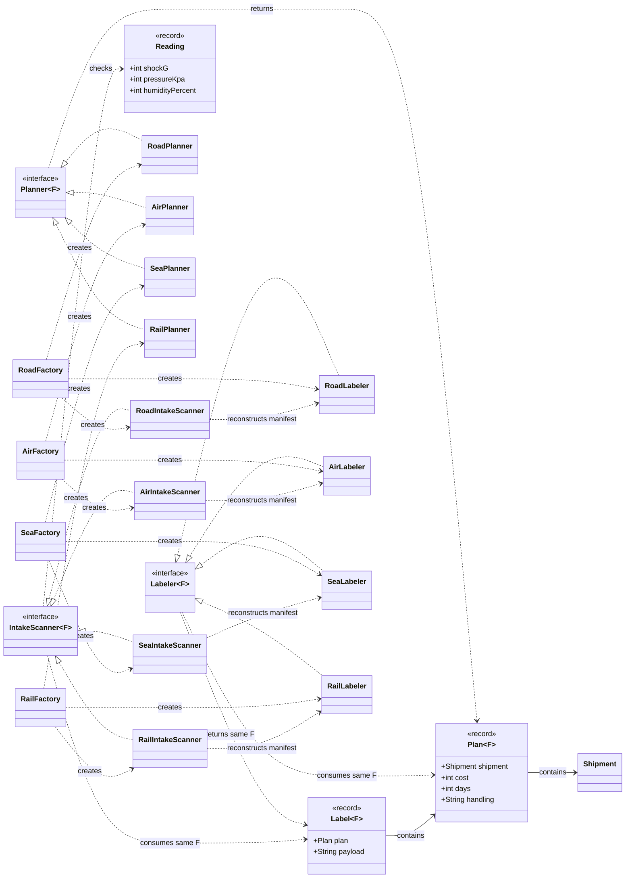

# UML class diagrams

The system is shown in three views for readability. Together they include all
product implementations, creators, factories and the client. `F` is the same
family type throughout each product kit. The model records are shown where
their role in compatibility matters.

## Abstract Factory part and client

## Factory Method part

`prepare` calls the overridable `createPlanner` before checking the resulting
plan against the budget and deadline. This is the inheritance relationship
that implements Factory Method. The four concrete factories also provide
the matching concrete Creator.

## All concrete products and family consistency

Each row of implementations binds `F` to its own marker: `Road`, `Air`,
`Sea` or `Rail`. All four marker classes implement `Family`. For example,
`RoadPlanner` implements `Planner<Road>` and returns `Plan<Road>`.

## How to read relationships

- `<|..` — realization: a concrete class implements an interface.
- `<|--` — generalization: a concrete Creator extends the abstract Creator.
- `-->` — association: an object holds a reference to another object.
- `..>` — dependency: a class uses, creates or refers to another type.

The diagrams use Mermaid and can be viewed in a Markdown viewer that supports
Mermaid. Neither composition diamonds nor ownership/lifetime guarantees are
claimed for injected products.
